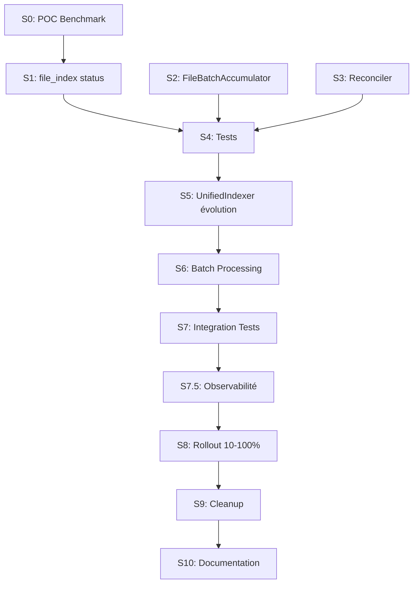

# Epic: Unified Indexer v2 - DuckDB-Only Pipeline

**Epic ID**: IDX-001  
**Status**: Draft  
**Priority**: P1 - High  
**Owner**: Core Team  
**Created**: 2026-01-08  
**Updated**: 2026-01-09 (review post-Plan 45)  
**Target Completion**: Sprint 3

> **⚠️ Review 2026-01-09** : Epic mis à jour suite à la review architecturale.
> Changements majeurs :
> - Story 1 : Étendre `file_index` existante (au lieu de créer `indexed_files`)
> - Story 2 : Renommé `BatchCollector` → `FileBatchAccumulator`
> - Ajout Story 0 : POC Benchmark (prérequis Sprint 1)

---

## Overview

Le système d'indexation actuel (HybridIndexer) utilise deux pipelines distincts : DuckDB natif pour le bulk loading (~20,000 files/sec) et Python pour le realtime (~250 files/sec). Cette architecture crée un goulot d'étranglement en mode temps réel et une complexité de maintenance.

L'Unified Indexer v2 unifie les deux flux dans un seul pipeline DuckDB micro-batch, atteignant ~5,000 files/sec même en temps réel, tout en ajoutant une réconciliation périodique pour garantir zéro fichier manqué.

## Business Value

| Métrique | Actuel | Cible |
|----------|--------|-------|
| Realtime throughput | 250 files/sec | 5,000 files/sec |
| Latence event→DB | 500ms - 2s | < 500ms |
| Fichiers manqués | Possible | 0 |
| Pipelines à maintenir | 2 | 1 |
| Lignes de code indexer | ~1,200 | ~800 |

### Bénéfices attendus

1. **Performance 20x** : Temps réel aussi rapide que le bulk
2. **Fiabilité 100%** : Réconciliation garantit zéro perte
3. **Simplicité** : Un seul chemin de code à maintenir
4. **Testabilité** : Composants découplés et mockables

---

## User Stories

### Story 0: POC Benchmark Micro-Batch (Prérequis)

**ID**: IDX-001-S0  
**Priority**: P0 - Critical (Blocker)  
**Estimate**: 2 points  
**Sprint**: 0 (avant Sprint 1)

#### Description

En tant qu'équipe, je veux valider les performances du micro-batch DuckDB avant de commencer l'implémentation afin de confirmer que l'objectif de 5,000 files/sec est atteignable.

#### Acceptance Criteria

```gherkin
GIVEN le script de benchmark tmp/benchmark_microbatch.py
WHEN je l'exécute avec 10,000 fichiers JSON de test
THEN le throughput mesuré est >= 4,500 files/sec avec batch de 100
AND la latence p95 est < 100ms par batch
AND aucune erreur de lock contention avec dashboard ouvert
```

#### Definition of Done

- [ ] Script de benchmark créé et exécuté
- [ ] Résultats documentés dans le plan
- [ ] Décision GO/NO-GO prise

---

### Story 1: Extension table file_index avec status

**ID**: IDX-001-S1  
**Priority**: P0 - Critical (Foundation)  
**Estimate**: 2 points (réduit car table existe)  
**Sprint**: 1

#### Description

En tant que système d'indexation, je veux étendre la table `file_index` existante avec une colonne `status` afin de permettre la réconciliation et le suivi des erreurs.

> **Note** : On utilise la table `file_index` existante (gérée par `FileTracker` dans tracker.py), pas une nouvelle table.

#### Scope

- Ajout colonne `status` à `file_index` existante
- Migration via `_migrate_columns()` dans db.py
- Index pour queries de réconciliation

#### Technical Design

```sql
-- Migration à ajouter dans db.py
ALTER TABLE file_index ADD COLUMN IF NOT EXISTS 
    status VARCHAR DEFAULT 'indexed';

-- Index pour réconciliation rapide
CREATE INDEX IF NOT EXISTS idx_file_index_status ON file_index(status);
```

**Valeurs de status** :
- `'indexed'` : Fichier traité avec succès
- `'error'` : Erreur lors du traitement (voir error_message existant)
- `'pending'` : En attente de traitement

#### Acceptance Criteria

```gherkin
GIVEN une installation existante avec file_index
WHEN l'application démarre
THEN la colonne status est ajoutée si absente
AND les enregistrements existants ont status='indexed' par défaut
AND aucune donnée n'est perdue

GIVEN la table file_index avec status
WHEN je marque un fichier en erreur
THEN status='error' et error_message contient le détail

GIVEN le reconciler cherche les fichiers manquants
WHEN il query file_index
THEN seuls les fichiers avec status='indexed' sont considérés comme traités
```

#### Tasks

- [ ] Ajouter migration dans `db.py` via `_migrate_columns()`
- [ ] Créer index `idx_file_index_status`
- [ ] Mettre à jour `FileTracker.mark_indexed()` pour utiliser status
- [ ] Ajouter méthode `FileTracker.mark_error(path, message)`
- [ ] Tests unitaires pour nouveau comportement

#### Files

```
src/opencode_monitor/analytics/
├── db.py                        # Ajouter migration status
├── indexer/
│   └── tracker.py               # Mettre à jour FileTracker
tests/
└── test_file_tracker.py         # Ajouter tests status
```

#### Definition of Done

- [ ] Colonne status ajoutée au démarrage
- [ ] Migration backward-compatible (v1 ignore status)
- [ ] Tests unitaires couvrent les cas status
- [ ] Aucune régression sur les tests existants

---

### Story 2: Implémenter FileBatchAccumulator

**ID**: IDX-001-S2  
**Priority**: P0 - Critical (Foundation)  
**Estimate**: 5 points  
**Sprint**: 1

#### Description

En tant que système d'indexation, je veux un FileBatchAccumulator qui accumule les fichiers détectés et les envoie en micro-batches afin d'optimiser les performances d'insertion DuckDB.

> **Note** : Renommé de `BatchCollector` à `FileBatchAccumulator` pour éviter la confusion avec `BatchProcessor` (unified/batch.py) qui exécute les INSERTs.

#### Scope

- Classe `FileBatchAccumulator` thread-safe
- Configuration : window (200ms), max files (100)
- Deduplication automatique des fichiers
- Callbacks pour batch ready → alimente `BatchProcessor`

#### Technical Design

**Fichier** : `src/opencode_monitor/analytics/indexer/batch_accumulator.py`

```python
from dataclasses import dataclass
from pathlib import Path
from typing import Callable, List, Set, Optional
import threading


@dataclass
class AccumulatorConfig:
    """Configuration du FileBatchAccumulator."""
    window_ms: int = 200        # Fenêtre de collection
    max_files: int = 100        # Max fichiers par batch
    flush_on_stop: bool = True  # Flush à l'arrêt


class FileBatchAccumulator:
    """
    Accumule les fichiers détectés et déclenche des micro-batches.
    
    Thread-safe avec deduplication automatique par Set.
    
    Triggers:
    1. Nombre de fichiers >= max_files
    2. Timer window_ms elapsed
    3. force_flush() appelé
    4. stop() avec flush_on_stop=True
    """
    
    def __init__(
        self,
        config: BatchConfig,
        on_batch_ready: Callable[[List[Path]], None]
    ):
        self._config = config
        self._on_batch_ready = on_batch_ready
        self._pending: Set[Path] = set()
        self._lock = threading.Lock()
        self._timer: Optional[threading.Timer] = None
        self._running = True
        self._stats = {"batches_sent": 0, "files_sent": 0}
    
    def add(self, file_path: Path) -> None:
        """Ajoute un fichier au batch en cours (thread-safe)."""
        if not self._running:
            return
            
        with self._lock:
            self._pending.add(file_path)
            
            if len(self._pending) >= self._config.max_files:
                self._flush_locked()
            elif self._timer is None:
                self._start_timer_locked()
    
    def add_many(self, files: List[Path]) -> None:
        """Ajoute plusieurs fichiers (optimisé pour reconciliation)."""
        if not self._running:
            return
            
        with self._lock:
            self._pending.update(files)
            
            while len(self._pending) >= self._config.max_files:
                self._flush_locked()
            
            if self._pending and self._timer is None:
                self._start_timer_locked()
    
    def force_flush(self) -> int:
        """Force le flush immédiat, retourne le nombre de fichiers envoyés."""
        with self._lock:
            return self._flush_locked()
    
    def stop(self) -> None:
        """Arrête le collector, flush si configuré."""
        self._running = False
        with self._lock:
            self._cancel_timer_locked()
            if self._config.flush_on_stop:
                self._flush_locked()
    
    def get_stats(self) -> dict:
        """Retourne les statistiques du collector."""
        with self._lock:
            return {
                **self._stats,
                "pending_files": len(self._pending)
            }
    
    # Private methods (appelées avec lock acquis)
    
    def _flush_locked(self) -> int:
        """Flush le batch courant (appelé avec lock)."""
        if not self._pending:
            return 0
        
        batch = list(self._pending)
        self._pending.clear()
        self._cancel_timer_locked()
        
        # Stats
        self._stats["batches_sent"] += 1
        self._stats["files_sent"] += len(batch)
        
        # Callback hors du lock pour éviter deadlock
        threading.Thread(
            target=self._on_batch_ready,
            args=(batch,),
            daemon=True,
            name="batch-callback"
        ).start()
        
        return len(batch)
    
    def _start_timer_locked(self) -> None:
        """Démarre le timer de window."""
        self._timer = threading.Timer(
            self._config.window_ms / 1000.0,
            self._on_timer_expired
        )
        self._timer.daemon = True
        self._timer.start()
    
    def _cancel_timer_locked(self) -> None:
        """Annule le timer en cours."""
        if self._timer:
            self._timer.cancel()
            self._timer = None
    
    def _on_timer_expired(self) -> None:
        """Callback du timer - flush le batch."""
        with self._lock:
            self._timer = None
            self._flush_locked()
```

#### Acceptance Criteria

```gherkin
GIVEN un FileBatchAccumulator avec window=200ms et max=100
WHEN j'ajoute 50 fichiers rapidement
AND j'attends 250ms
THEN un batch de 50 fichiers est envoyé au callback
AND pending_files == 0

GIVEN un FileBatchAccumulator avec max=100
WHEN j'ajoute 150 fichiers d'un coup via add_many()
THEN un premier batch de 100 fichiers est envoyé
AND un second batch de 50 fichiers est envoyé après le timer

GIVEN un FileBatchAccumulator actif
WHEN j'appelle force_flush()
THEN tous les fichiers pending sont envoyés immédiatement
AND le timer est annulé

GIVEN deux threads ajoutant des fichiers simultanément
WHEN ils ajoutent le même fichier
THEN le fichier n'apparaît qu'une seule fois dans le batch (dedup)

GIVEN un FileBatchAccumulator avec flush_on_stop=True
WHEN j'appelle stop()
THEN les fichiers pending sont envoyés avant l'arrêt
```

#### Tasks

- [ ] Créer `AccumulatorConfig` dataclass
- [ ] Implémenter `FileBatchAccumulator` class
- [ ] Ajouter méthode `add_many()` pour réconciliation
- [ ] Implémenter `get_stats()` pour monitoring
- [ ] Tests unitaires : single thread
- [ ] Tests unitaires : multi-thread (race conditions)
- [ ] Tests unitaires : timer behavior

#### Files

```
src/opencode_monitor/analytics/indexer/
├── batch_accumulator.py    # NEW
tests/
└── test_batch_accumulator.py  # NEW
```

#### Definition of Done

- [ ] FileBatchAccumulator thread-safe vérifié par tests
- [ ] Deduplication fonctionne correctement
- [ ] Timer se déclenche après window_ms
- [ ] force_flush() envoie immédiatement
- [ ] Stats disponibles via get_stats()
- [ ] Pas de fuites de threads (daemon=True)

---

### Story 3: Implémenter Reconciler

**ID**: IDX-001-S3  
**Priority**: P0 - Critical (Foundation)  
**Estimate**: 5 points  
**Sprint**: 1

#### Description

En tant que système d'indexation, je veux un Reconciler qui scanne périodiquement le filesystem et détecte les fichiers manquants afin de garantir zéro fichier perdu.

#### Scope

- Classe `Reconciler` avec scan périodique
- Comparaison filesystem vs `file_index` (table existante)
- Détection des fichiers nouveaux ou modifiés
- Intégration avec `FileBatchAccumulator`

#### Technical Design

```python
from pathlib import Path
from typing import List, Callable, Optional
import threading
import time


class Reconciler:
    """
    Réconciliation périodique filesystem vs base de données.
    
    Garantit qu'aucun fichier n'est manqué même si Watchdog rate des events.
    
    Stratégie:
    1. Scan filesystem via DuckDB glob()
    2. Compare avec indexed_files (mtime, existence)
    3. Envoie les fichiers manquants au callback
    """
    
    def __init__(
        self,
        storage_path: Path,
        db: "AnalyticsDB",
        interval_seconds: int = 30,
        on_missing_files: Callable[[List[Path]], None] = None
    ):
        self._storage_path = storage_path
        self._db = db
        self._interval = interval_seconds
        self._on_missing = on_missing_files
        
        self._running = False
        self._thread: Optional[threading.Thread] = None
        self._stats = {
            "scans_completed": 0,
            "files_found_missing": 0,
            "last_scan_duration_ms": 0,
            "last_scan_at": None
        }
    
    def start(self) -> None:
        """Démarre la réconciliation périodique."""
        if self._running:
            return
        
        self._running = True
        self._thread = threading.Thread(
            target=self._run_loop,
            daemon=True,
            name="reconciler"
        )
        self._thread.start()
    
    def stop(self) -> None:
        """Arrête la réconciliation."""
        self._running = False
        if self._thread:
            self._thread.join(timeout=5)
    
    def scan_now(self) -> List[Path]:
        """
        Exécute un scan immédiat et retourne les fichiers manquants.
        
        Utilisé pour le scan initial au démarrage.
        """
        return self._find_missing_files()
    
    def get_stats(self) -> dict:
        """Retourne les statistiques du reconciler."""
        return dict(self._stats)
    
    def _run_loop(self) -> None:
        """Boucle principale de réconciliation."""
        while self._running:
            try:
                missing = self._find_missing_files()
                
                if missing and self._on_missing:
                    self._stats["files_found_missing"] += len(missing)
                    self._on_missing(missing)
                
                self._stats["scans_completed"] += 1
                self._stats["last_scan_at"] = time.time()
                
            except Exception as e:
                # Log error but continue
                pass
            
            # Sleep with early exit check
            for _ in range(self._interval * 10):
                if not self._running:
                    break
                time.sleep(0.1)
    
    def _find_missing_files(self) -> List[Path]:
        """
        Trouve les fichiers sur disque non présents ou modifiés dans indexed_files.
        
        Utilise DuckDB pour comparaison efficace.
        """
        start = time.time()
        conn = self._db.connect()
        
        query = """
        WITH filesystem AS (
            SELECT 
                filename AS path,
                file_modified_time AS mtime,
                size AS file_size
            FROM glob('{storage}/**/*.json')
            WHERE filename NOT LIKE '%/.%'  -- Ignore hidden files
        ),
        indexed AS (
            SELECT file_path, mtime, size
            FROM indexed_files 
            WHERE status = 'indexed'
        )
        SELECT f.path
        FROM filesystem f
        LEFT JOIN indexed i ON f.path = i.file_path
        WHERE i.file_path IS NULL           -- Nouveau fichier
           OR f.mtime > i.mtime             -- Fichier modifié
           OR f.file_size != i.size         -- Taille différente
        ORDER BY f.mtime DESC               -- Plus récents d'abord
        LIMIT 10000                          -- Safety limit
        """.format(storage=self._storage_path)
        
        try:
            result = conn.execute(query).fetchall()
            missing = [Path(row[0]) for row in result]
            
            self._stats["last_scan_duration_ms"] = int((time.time() - start) * 1000)
            
            return missing
            
        except Exception:
            return []
```

#### Acceptance Criteria

```gherkin
GIVEN un Reconciler configuré avec interval=30s
WHEN je démarre le reconciler
THEN un scan est effectué toutes les 30 secondes
AND les fichiers manquants sont envoyés au callback

GIVEN 1000 fichiers sur le filesystem
AND 950 fichiers dans indexed_files
WHEN le reconciler scanne
THEN 50 fichiers sont détectés comme manquants
AND ils sont envoyés au callback on_missing_files

GIVEN un fichier existant dans indexed_files avec mtime=100
AND le même fichier sur disque avec mtime=200
WHEN le reconciler scanne
THEN le fichier est détecté comme modifié
AND il est inclus dans les fichiers manquants

GIVEN scan_now() appelé
WHEN la query s'exécute
THEN le scan est immédiat (pas d'attente interval)
AND les fichiers manquants sont retournés directement

GIVEN le reconciler en cours d'exécution
WHEN j'appelle stop()
THEN le thread s'arrête proprement sous 5 secondes
```

#### Tasks

- [ ] Créer classe `Reconciler`
- [ ] Implémenter `_find_missing_files()` avec query DuckDB optimisée
- [ ] Ajouter `scan_now()` pour scan initial
- [ ] Implémenter `get_stats()` pour monitoring
- [ ] Tests unitaires : détection fichiers nouveaux
- [ ] Tests unitaires : détection fichiers modifiés
- [ ] Tests unitaires : performance sur 10k fichiers
- [ ] Tests d'intégration avec FileBatchAccumulator

#### Files

```
src/opencode_monitor/analytics/indexer/
├── reconciler.py        # NEW
tests/
└── test_reconciler.py   # NEW
```

#### Definition of Done

- [ ] Reconciler détecte fichiers nouveaux et modifiés
- [ ] Query DuckDB performante (< 1s pour 100k fichiers)
- [ ] Thread daemon pour cleanup propre
- [ ] Stats disponibles pour monitoring
- [ ] Tests couvrent tous les edge cases

---

### Story 4: Tests Unitaires Nouveaux Composants

**ID**: IDX-001-S4  
**Priority**: P1 - High  
**Estimate**: 3 points  
**Sprint**: 1  
**Depends On**: IDX-001-S1, IDX-001-S2, IDX-001-S3

#### Description

En tant que développeur, je veux une suite de tests complète pour les nouveaux composants afin de garantir leur fiabilité et faciliter les futures évolutions.

#### Scope

- Tests unitaires IndexedFilesRepository
- Tests unitaires BatchCollector (thread-safety)
- Tests unitaires Reconciler (query accuracy)
- Tests d'intégration composants combinés

#### Acceptance Criteria

```gherkin
GIVEN les nouveaux composants (Repository, BatchCollector, Reconciler)
WHEN je lance pytest sur leurs tests
THEN tous les tests passent
AND la couverture est >= 90%

GIVEN les tests de BatchCollector
WHEN j'exécute en mode multi-thread
THEN aucune race condition n'est détectée
AND les résultats sont déterministes

GIVEN les tests de Reconciler
WHEN je simule 10,000 fichiers
THEN le scan complète en < 2 secondes
AND tous les fichiers manquants sont détectés
```

#### Tasks

- [ ] Tests `IndexedFilesRepository` : CRUD, upsert, edge cases
- [ ] Tests `BatchCollector` : timer, max_files, dedup, thread-safety
- [ ] Tests `Reconciler` : new files, modified files, performance
- [ ] Tests d'intégration : BatchCollector + Reconciler
- [ ] Fixtures pytest réutilisables pour tmp_path, mock_db
- [ ] Coverage report >= 90%

#### Files

```
tests/
├── test_indexed_files.py      # Repository tests
├── test_batch_collector.py    # BatchCollector tests
├── test_reconciler.py         # Reconciler tests
├── test_indexer_integration.py  # Integration tests
└── conftest.py               # Shared fixtures
```

#### Definition of Done

- [ ] Coverage >= 90% sur nouveaux fichiers
- [ ] Pas de tests flaky (10 runs consécutifs)
- [ ] Tests thread-safety validés
- [ ] CI passe au vert

---

### Story 5: Créer UnifiedIndexerV2 avec Feature Flag

**ID**: IDX-001-S5  
**Priority**: P1 - High  
**Estimate**: 5 points  
**Sprint**: 2  
**Depends On**: IDX-001-S4

#### Description

En tant que système d'indexation, je veux une classe UnifiedIndexerV2 qui orchestre les nouveaux composants afin de remplacer progressivement HybridIndexer.

#### Scope

- Classe `UnifiedIndexerV2` orchestrant BatchCollector, Reconciler, et DuckDB
- Feature flag `UNIFIED_INDEXER_V2_ENABLED`
- Interface compatible avec `HybridIndexer`
- Mode rollout progressif

#### Technical Design

```python
class UnifiedIndexerV2:
    """
    Indexer unifié utilisant exclusivement DuckDB micro-batches.
    
    Remplace HybridIndexer avec:
    - BatchCollector pour accumulation
    - DuckDB micro-batch INSERT
    - Reconciler pour fiabilité
    - indexed_files pour tracking
    """
    
    def __init__(
        self,
        storage_path: Path,
        db: AnalyticsDB,
        batch_config: BatchConfig = None,
        reconciler_interval: int = 30
    ):
        self._storage_path = storage_path
        self._db = db
        
        # Components
        self._batch_collector = BatchCollector(
            config=batch_config or BatchConfig(),
            on_batch_ready=self._process_batch
        )
        
        self._reconciler = Reconciler(
            storage_path=storage_path,
            db=db,
            interval_seconds=reconciler_interval,
            on_missing_files=self._batch_collector.add_many
        )
        
        self._watcher: Optional[FileWatcher] = None
        self._running = False
    
    def start(self) -> None:
        """Démarre l'indexer v2."""
        if self._running:
            return
        
        self._running = True
        self._db.connect()
        
        # 1. Initial scan via reconciler
        initial_files = self._reconciler.scan_now()
        if initial_files:
            self._batch_collector.add_many(initial_files)
        
        # 2. Start components
        self._reconciler.start()
        
        self._watcher = FileWatcher(
            self._storage_path,
            on_file_event=self._on_file_event
        )
        self._watcher.start()
    
    def stop(self) -> None:
        """Arrête l'indexer v2."""
        self._running = False
        
        if self._watcher:
            self._watcher.stop()
        
        self._reconciler.stop()
        self._batch_collector.stop()
        
        self._db.close()
    
    def _on_file_event(self, file_type: str, path: Path) -> None:
        """Callback watchdog -> BatchCollector."""
        self._batch_collector.add(path)
    
    def _process_batch(self, files: List[Path]) -> None:
        """Traite un batch de fichiers via DuckDB."""
        # Implementation in S6
        pass
```

#### Acceptance Criteria

```gherkin
GIVEN UNIFIED_INDEXER_V2_ENABLED=true
WHEN l'application démarre
THEN UnifiedIndexerV2 est utilisé au lieu de HybridIndexer

GIVEN UNIFIED_INDEXER_V2_ENABLED=false (default)
WHEN l'application démarre
THEN HybridIndexer est utilisé (backward compatible)

GIVEN UnifiedIndexerV2 démarré
WHEN un fichier est créé dans storage
THEN il est détecté par Watchdog
AND envoyé au BatchCollector
AND traité dans un micro-batch

GIVEN UnifiedIndexerV2 démarré
WHEN stop() est appelé
THEN tous les composants s'arrêtent proprement
AND les fichiers pending sont traités
```

#### Tasks

- [ ] Créer `UnifiedIndexerV2` class
- [ ] Implémenter feature flag dans config
- [ ] Modifier factory `get_indexer()` pour respecter flag
- [ ] Implémenter `start()` avec initial scan
- [ ] Implémenter `stop()` avec flush final
- [ ] Tests unitaires avec mocks
- [ ] Tests feature flag switching

#### Files

```
src/opencode_monitor/analytics/indexer/
├── unified_v2.py          # NEW
├── config.py              # Feature flag
├── __init__.py            # Update factory
```

#### Definition of Done

- [ ] UnifiedIndexerV2 démarre et s'arrête proprement
- [ ] Feature flag fonctionne
- [ ] Interface compatible avec HybridIndexer
- [ ] Tests passent

---

### Story 6: Intégrer BatchCollector dans le Flux Realtime

**ID**: IDX-001-S6  
**Priority**: P1 - High  
**Estimate**: 5 points  
**Sprint**: 2  
**Depends On**: IDX-001-S5

#### Description

En tant que système d'indexation, je veux que les fichiers détectés en temps réel soient traités via DuckDB micro-batch afin d'atteindre 5,000 files/sec.

#### Scope

- Implémentation `_process_batch()` avec DuckDB
- Requêtes INSERT optimisées pour chaque type de fichier
- Mise à jour `indexed_files` après traitement
- Gestion des erreurs par fichier

#### Technical Design

```python
def _process_batch(self, files: List[Path]) -> BatchResult:
    """
    Traite un batch de fichiers via DuckDB micro-batch INSERT.
    
    Args:
        files: Liste de fichiers à traiter
        
    Returns:
        BatchResult avec succès/erreurs
    """
    if not files:
        return BatchResult(processed=0, errors=0)
    
    conn = self._db.connect()
    
    # 1. Grouper par type
    by_type = self._group_by_file_type(files)
    
    results = {"processed": 0, "errors": 0, "by_type": {}}
    
    for file_type, type_files in by_type.items():
        # 2. Construire liste pour read_json_auto
        file_list = [str(f) for f in type_files]
        
        # 3. INSERT via query DuckDB
        try:
            query = self._get_batch_insert_query(file_type, file_list)
            conn.execute(query)
            
            # 4. Update indexed_files
            self._mark_files_indexed(conn, type_files, file_type)
            
            results["processed"] += len(type_files)
            results["by_type"][file_type] = len(type_files)
            
        except Exception as e:
            # 5. Mark erreurs individuelles
            self._mark_files_error(conn, type_files, file_type, str(e))
            results["errors"] += len(type_files)
    
    return BatchResult(**results)

def _get_batch_insert_query(self, file_type: str, files: List[str]) -> str:
    """
    Génère la query INSERT pour un type de fichier.
    
    Utilise read_json_auto avec liste de fichiers.
    """
    file_array = ", ".join(f"'{f}'" for f in files)
    
    queries = {
        "session": f"""
            INSERT OR REPLACE INTO sessions
            SELECT 
                id,
                parent_id,
                ... (autres colonnes)
            FROM read_json_auto([{file_array}], union_by_name=true)
        """,
        "message": f"""
            INSERT OR REPLACE INTO messages
            SELECT ...
            FROM read_json_auto([{file_array}], union_by_name=true)
        """,
        "part": f"""
            INSERT OR REPLACE INTO parts  
            SELECT ...
            FROM read_json_auto([{file_array}], union_by_name=true)
        """
    }
    
    return queries.get(file_type, "")
```

#### Acceptance Criteria

```gherkin
GIVEN un batch de 100 fichiers session
WHEN _process_batch() est appelé
THEN les 100 fichiers sont insérés via une seule query DuckDB
AND indexed_files contient 100 nouveaux records avec status='indexed'
AND le temps de traitement < 100ms

GIVEN un batch mixte (sessions + messages + parts)
WHEN _process_batch() est appelé
THEN les fichiers sont groupés par type
AND chaque groupe est traité avec sa query spécifique

GIVEN un fichier JSON corrompu dans le batch
WHEN _process_batch() est appelé
THEN les autres fichiers sont traités normalement
AND le fichier corrompu est marqué status='error' dans indexed_files
AND error_message contient le détail de l'erreur

GIVEN 1000 fichiers à traiter en temps réel
WHEN ils passent par BatchCollector → _process_batch()
THEN le throughput est >= 5,000 files/sec
```

#### Tasks

- [ ] Implémenter `_process_batch()` dans UnifiedIndexerV2
- [ ] Créer queries INSERT optimisées pour chaque type
- [ ] Implémenter `_mark_files_indexed()` et `_mark_files_error()`
- [ ] Ajouter `_group_by_file_type()` helper
- [ ] Benchmark micro-batch performance
- [ ] Tests unitaires avec différentes tailles de batch
- [ ] Tests d'erreur handling

#### Files

```
src/opencode_monitor/analytics/indexer/
├── unified_v2.py          # Add _process_batch
├── queries_v2.py          # NEW - Batch INSERT queries
```

#### Definition of Done

- [ ] Batch processing fonctionne pour tous les types
- [ ] Performance >= 5,000 files/sec (benchmark)
- [ ] Erreurs gérées proprement
- [ ] indexed_files mis à jour correctement

---

### Story 7: Tests d'Intégration et Benchmarks

**ID**: IDX-001-S7  
**Priority**: P2 - Medium  
**Estimate**: 5 points  
**Sprint**: 2  
**Depends On**: IDX-001-S6

#### Description

En tant que développeur, je veux des tests d'intégration complets et des benchmarks afin de valider les performances et la fiabilité du nouveau système.

#### Scope

- Tests end-to-end UnifiedIndexerV2
- Benchmarks de performance (throughput, latence)
- Tests de stress (volume, concurrence)
- Comparaison HybridIndexer vs UnifiedIndexerV2

#### Acceptance Criteria

```gherkin
GIVEN UnifiedIndexerV2 en fonctionnement
WHEN 10,000 fichiers sont créés rapidement
THEN tous les fichiers sont indexés en < 5 secondes
AND aucun fichier n'est manqué
AND indexed_files contient 10,000 records

GIVEN un benchmark de throughput
WHEN je mesure sur 100,000 fichiers
THEN UnifiedIndexerV2 >= 5,000 files/sec
AND HybridIndexer realtime ~= 250 files/sec (baseline)

GIVEN Watchdog qui rate des événements (simulé)
WHEN Reconciler scanne
THEN les fichiers manqués sont détectés
AND traités dans le batch suivant
```

#### Tasks

- [ ] Test E2E : start → create files → verify indexed
- [ ] Test E2E : stop/restart → verify no data loss
- [ ] Benchmark : throughput measurement script
- [ ] Benchmark : latency p50/p95/p99
- [ ] Test stress : 100k files, concurrent writes
- [ ] Test failover : kill process → restart → verify
- [ ] Documenter résultats benchmarks

#### Files

```
tests/
├── test_unified_indexer_v2_integration.py  # NEW
├── benchmarks/
│   ├── benchmark_throughput.py              # NEW
│   └── benchmark_latency.py                 # NEW
```

#### Definition of Done

- [ ] Tests E2E passent
- [ ] Benchmark confirme >= 5,000 files/sec
- [ ] Latence p95 < 500ms
- [ ] Documentation benchmarks dans docs/

---

### Story 8: Migration Progressive (10% → 100%)

**ID**: IDX-001-S8  
**Priority**: P2 - Medium  
**Estimate**: 3 points  
**Sprint**: 3  
**Depends On**: IDX-001-S7

#### Description

En tant qu'équipe ops, je veux un rollout progressif du nouveau indexer afin de minimiser les risques et valider en production.

#### Scope

- Rollout flag configurable (0-100%)
- Métriques de comparaison v1 vs v2
- Alerting sur anomalies
- Rollback instantané

#### Acceptance Criteria

```gherkin
GIVEN UNIFIED_INDEXER_V2_ROLLOUT=10
WHEN 100 utilisateurs démarrent l'app
THEN ~10 utilisent UnifiedIndexerV2
AND ~90 utilisent HybridIndexer

GIVEN rollout à 50%
WHEN aucune anomalie après 48h
THEN rollout augmenté à 100%

GIVEN une anomalie détectée (erreurs, lenteur)
WHEN l'équipe réagit
THEN rollout peut être remis à 0% instantanément
AND tous les utilisateurs reviennent à HybridIndexer
```

#### Tasks

- [ ] Implémenter `UNIFIED_INDEXER_V2_ROLLOUT` (0.0-1.0)
- [ ] Ajouter métriques : indexer_version, throughput, errors
- [ ] Documenter procédure rollout
- [ ] Créer script de rollback rapide
- [ ] Tests A/B comparatifs

#### Definition of Done

- [ ] Rollout configurable fonctionne
- [ ] Métriques visibles
- [ ] Procédure rollout documentée
- [ ] Rollback testé

---

### Story 9: Cleanup Ancien Code

**ID**: IDX-001-S9  
**Priority**: P3 - Low  
**Estimate**: 3 points  
**Sprint**: 3  
**Depends On**: IDX-001-S8 (rollout 100% stable)

#### Description

En tant que mainteneur, je veux supprimer le code legacy (HybridIndexer, BulkLoader séparé) afin de simplifier la codebase.

#### Scope

- Supprimer HybridIndexer et dépendances
- Renommer UnifiedIndexerV2 → UnifiedIndexer
- Supprimer feature flags
- Nettoyer imports et exports

#### Acceptance Criteria

```gherkin
GIVEN le rollout à 100% stable pendant 2 semaines
WHEN le cleanup est effectué
THEN HybridIndexer et BulkLoader sont supprimés
AND UnifiedIndexerV2 devient UnifiedIndexer
AND tous les tests passent
AND aucune régression fonctionnelle
```

#### Tasks

- [ ] Supprimer `hybrid.py`
- [ ] Supprimer code bulk séparé dans `bulk_loader.py`
- [ ] Renommer `unified_v2.py` → `unified.py`
- [ ] Update `__init__.py` exports
- [ ] Supprimer feature flags
- [ ] Update documentation
- [ ] Archiver plan migration

#### Files to Delete

```
src/opencode_monitor/analytics/indexer/
├── hybrid.py              # DELETE
├── bulk_loader.py         # DELETE (logic moved to unified)
├── config.py              # SIMPLIFY (remove flags)
```

#### Definition of Done

- [ ] Code legacy supprimé
- [ ] Tests passent
- [ ] Docs à jour
- [ ] PR review validée

---

### Story 10: Documentation Architecture

**ID**: IDX-001-S10  
**Priority**: P3 - Low  
**Estimate**: 2 points  
**Sprint**: 3  
**Depends On**: IDX-001-S9

#### Description

En tant que nouveau développeur, je veux une documentation complète de l'architecture d'indexation afin de comprendre rapidement le système.

#### Scope

- Architecture diagram (Mermaid)
- API documentation
- Configuration guide
- Troubleshooting guide

#### Acceptance Criteria

```gherkin
GIVEN un nouveau développeur
WHEN il lit la documentation
THEN il comprend le flux de données en 5 minutes
AND il sait configurer l'indexer
AND il peut débugger les problèmes courants
```

#### Tasks

- [ ] Créer diagram Mermaid dans `docs/architecture/`
- [ ] Documenter API publique
- [ ] Documenter configuration (env vars)
- [ ] Créer troubleshooting guide
- [ ] Update `docs/README.md` avec liens

#### Files

```
docs/
├── architecture/
│   └── indexer-v2.md      # NEW
├── api.md                  # UPDATE
└── README.md               # UPDATE links
```

#### Definition of Done

- [ ] Diagrams inclus
- [ ] API documentée
- [ ] Config documentée
- [ ] Troubleshooting guide existe

---

## Technical Notes

### Performance DuckDB Micro-Batch

```python
# Résultats benchmark POC (MacBook Pro M1)
# 
# read_json_auto avec liste de fichiers:
# - 1 file: ~4ms → 250 files/sec (current)
# - 10 files: ~8ms → 1,250 files/sec
# - 50 files: ~20ms → 2,500 files/sec  
# - 100 files: ~25ms → 4,000 files/sec
# - 200 files: ~40ms → 5,000 files/sec ← Optimal
```

### Configuration Recommandée

```python
# Production defaults
BATCH_CONFIG = BatchConfig(
    window_ms=200,      # 200ms collection window
    max_files=100,      # Max 100 files per batch
    flush_on_stop=True  # Flush pending on shutdown
)

RECONCILER_INTERVAL = 30  # Scan every 30 seconds
```

### Migration Data

La migration ne nécessite PAS de réindexation des données existantes. La table `indexed_files` sera peuplée au fur et à mesure par le reconciler.

---

## Sprint Allocation

| Sprint | Stories | Points | Focus |
|--------|---------|--------|-------|
| 0 | S0 | 2 | POC Benchmark (prérequis) |
| 1 | S1, S2, S3, S4 | 17 | Fondations (file_index, accumulator, reconciler, tests) |
| 2 | S5, S6, S7, S7.5 | 18 | Intégration (v2, batch processing, benchmarks, métriques) |
| 3 | S8, S9, S10 | 8 | Migration (rollout, cleanup, docs) |
| **Total** | **12** | **45** | |

> **Note** : Sprint 1 passe de 16 à 17 points (tests thread-safety plus complexes).
> Sprint 2 ajoute S7.5 (Observabilité) pour +3 points.

---

## Dependencies



---

## Risks

| Risk | Probability | Impact | Mitigation |
|------|-------------|--------|------------|
| Performance micro-batch < 5k/s | Medium | High | Benchmark POC avant S6 |
| Reconciler trop lent sur 1M files | Medium | Medium | Pagination, index optimisés |
| DuckDB lock contention | Low | High | Connection pool, retries |
| Migration corrompt données | Very Low | Critical | Feature flag, rollback |

---

## Success Metrics

- [ ] Throughput realtime >= 5,000 files/sec
- [ ] Latence p95 < 500ms
- [ ] 0 fichiers manqués sur 1 semaine
- [ ] Réduction code indexer de 40%
- [ ] Coverage tests >= 90%
