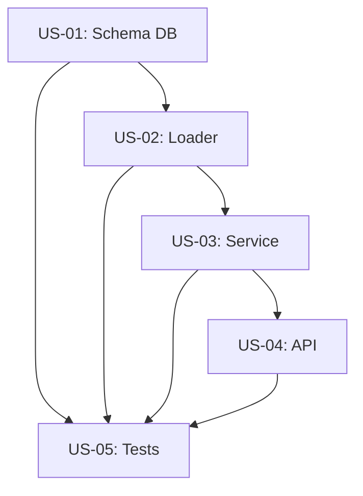

# Sprint - Parts Enrichment (Janvier 2026)

Enrichissement du loader pour traiter les 5 types de parts actuellement ignorés (reasoning, step-finish, step-start, patch, compaction, file).

## Objectifs

- **Debugging** : Comprendre le raisonnement de l'agent via reasoning parts
- **Coûts précis** : Tokens par step plutôt que par message
- **Traçabilité** : Snapshots git pour historique modifications
- **Analytics** : Métriques sur le processus de réflexion

## Résumé des changements

| Story | Objectif | Points | Status |
|-------|----------|--------|--------|
| US-01 | Schema DB - Nouvelles tables et colonnes | 3 | A faire |
| US-02 | Loader - Parts enrichis | 5 | A faire |
| US-03 | Service - Méthodes de requête | 3 | A faire |
| US-04 | API - Nouveaux endpoints | 3 | A faire |
| US-05 | Tests - Couverture complète | 3 | A faire |
| **Total** | | **17** | |

---

## Sprint 1 : Infrastructure DB

### US-01: Schema DB - Nouvelles tables et colonnes

**En tant que** développeur backend,
**Je veux** un schéma DB enrichi avec les nouvelles tables et colonnes,
**Afin de** stocker les données des parts enrichis (reasoning, steps, patches).

**Estimation** : 3 points

**Critères d'acceptation**:
- [ ] Table `step_events` créée avec colonnes : id, session_id, message_id, event_type, reason, snapshot_hash, cost, tokens_input, tokens_output, tokens_reasoning, tokens_cache_read, tokens_cache_write, created_at
- [ ] Table `patches` créée avec colonnes : id, session_id, message_id, git_hash, files (TEXT[]), created_at
- [ ] Colonne `parts.reasoning_text` (TEXT) ajoutée via migration
- [ ] Colonne `parts.anthropic_signature` (TEXT) ajoutée via migration
- [ ] Colonne `parts.compaction_auto` (BOOLEAN) ajoutée via migration
- [ ] Colonne `parts.file_mime` (VARCHAR) ajoutée via migration
- [ ] Colonne `parts.file_name` (VARCHAR) ajoutée via migration
- [ ] Index créés sur `step_events(session_id)` et `patches(session_id)`
- [ ] Tables ajoutées à `_MANAGED_TABLES` dans db.py
- [ ] Migration idempotente (safe to run multiple times)

**Fichiers impactés**:
- `src/opencode_monitor/analytics/db.py`

**Notes techniques**:
```sql
-- Nouvelles tables
CREATE TABLE IF NOT EXISTS step_events (
    id VARCHAR PRIMARY KEY,
    session_id VARCHAR NOT NULL,
    message_id VARCHAR NOT NULL,
    event_type VARCHAR NOT NULL,  -- 'start' ou 'finish'
    reason VARCHAR,
    snapshot_hash VARCHAR,
    cost DECIMAL(10,6) DEFAULT 0,
    tokens_input INTEGER DEFAULT 0,
    tokens_output INTEGER DEFAULT 0,
    tokens_reasoning INTEGER DEFAULT 0,
    tokens_cache_read INTEGER DEFAULT 0,
    tokens_cache_write INTEGER DEFAULT 0,
    created_at TIMESTAMP
);

CREATE TABLE IF NOT EXISTS patches (
    id VARCHAR PRIMARY KEY,
    session_id VARCHAR NOT NULL,
    message_id VARCHAR NOT NULL,
    git_hash VARCHAR NOT NULL,
    files TEXT[],
    created_at TIMESTAMP
);
```

---

## Sprint 2 : Loader Enrichissement

### US-02: Loader - Parts enrichis

**En tant que** développeur backend,
**Je veux** que le loader traite les 5 types de parts manquants,
**Afin de** capturer toutes les données disponibles dans les fichiers JSON.

**Estimation** : 5 points

**Critères d'acceptation**:
- [ ] `reasoning` parts : extraire text, metadata.anthropic.signature, time.start, time.end
- [ ] `step-start` parts : stocker dans step_events avec event_type='start', extraire snapshot
- [ ] `step-finish` parts : stocker dans step_events avec event_type='finish', extraire reason, snapshot, cost, tokens
- [ ] `patch` parts : stocker dans patches avec git_hash et files[]
- [ ] `compaction` parts : stocker dans parts avec compaction_auto=True/False
- [ ] `file` parts : stocker référence (mime, filename) sans contenu base64
- [ ] Batch insert performant (500 items par batch)
- [ ] Logs informatifs : "Loaded X step_events, Y patches, Z reasoning parts"
- [ ] Gestion d'erreurs robuste (continue on error)

**Fichiers impactés**:
- `src/opencode_monitor/analytics/loaders/parts.py`

**Notes techniques**:
```python
# Après le elif part_type == "tool":

elif part_type == "reasoning":
    text = data.get("text", "")
    metadata = data.get("metadata", {})
    signature = metadata.get("anthropic", {}).get("signature")
    # Insert into parts with reasoning_text and anthropic_signature

elif part_type == "step-start":
    snapshot = data.get("snapshot")
    # Insert into step_events with event_type='start'

elif part_type == "step-finish":
    reason = data.get("reason")
    snapshot = data.get("snapshot")
    cost = data.get("cost", 0)
    tokens = data.get("tokens", {})
    # Insert into step_events with event_type='finish'

elif part_type == "patch":
    git_hash = data.get("hash")
    files = data.get("files", [])
    # Insert into patches table

elif part_type == "compaction":
    auto = data.get("auto", False)
    # Insert into parts with compaction_auto

elif part_type == "file":
    mime = data.get("mime")
    filename = data.get("filename")
    # Insert into parts with file_mime, file_name (skip base64 content)
```

---

## Sprint 3 : Service Layer

### US-03: Service - Méthodes de requête

**En tant que** développeur API,
**Je veux** des méthodes dans TracingDataService pour accéder aux nouvelles données,
**Afin de** les exposer via l'API.

**Estimation** : 3 points

**Critères d'acceptation**:
- [ ] `get_session_reasoning(session_id)` : retourne liste des pensées avec timestamps
- [ ] `get_session_steps(session_id)` : retourne timeline des steps avec tokens/coût
- [ ] `get_session_git_history(session_id)` : retourne historique des patches git
- [ ] `get_session_precise_cost(session_id)` : calcule coût depuis step-finish (plus précis)
- [ ] Format de retour standardisé avec meta/summary/details
- [ ] Optimisation : requêtes avec indexes utilisés

**Fichiers impactés**:
- `src/opencode_monitor/analytics/tracing/session_queries.py` (nouveau mixin ou extension)

**Notes techniques**:
```python
def get_session_reasoning(self, session_id: str) -> dict:
    """Get reasoning parts for a session."""
    rows = self._conn.execute("""
        SELECT id, reasoning_text, anthropic_signature, created_at
        FROM parts
        WHERE session_id = ? AND part_type = 'reasoning'
        ORDER BY created_at
    """, [session_id]).fetchall()
    
    return {
        "meta": {"session_id": session_id, "count": len(rows)},
        "details": [
            {"id": r[0], "text": r[1], "signature": r[2], "timestamp": r[3]}
            for r in rows
        ]
    }

def get_session_steps(self, session_id: str) -> dict:
    """Get step events timeline with precise token counts."""
    rows = self._conn.execute("""
        SELECT id, event_type, reason, snapshot_hash, cost,
               tokens_input, tokens_output, tokens_reasoning,
               tokens_cache_read, tokens_cache_write, created_at
        FROM step_events
        WHERE session_id = ?
        ORDER BY created_at
    """, [session_id]).fetchall()
    
    # Calculate totals
    total_cost = sum(r[4] or 0 for r in rows if r[1] == 'finish')
    total_tokens = sum((r[5] or 0) + (r[6] or 0) + (r[7] or 0) for r in rows)
    
    return {
        "meta": {"session_id": session_id, "count": len(rows)},
        "summary": {"total_cost": total_cost, "total_tokens": total_tokens},
        "details": [...]
    }

def get_session_git_history(self, session_id: str) -> dict:
    """Get git patches history for a session."""
    rows = self._conn.execute("""
        SELECT id, git_hash, files, created_at
        FROM patches
        WHERE session_id = ?
        ORDER BY created_at
    """, [session_id]).fetchall()
    
    return {
        "meta": {"session_id": session_id, "commits": len(rows)},
        "details": [
            {"id": r[0], "hash": r[1], "files": r[2], "timestamp": r[3]}
            for r in rows
        ]
    }
```

---

## Sprint 4 : API Endpoints

### US-04: API - Nouveaux endpoints

**En tant qu'** utilisateur de l'API,
**Je veux** des endpoints pour accéder aux données enrichies,
**Afin de** les afficher dans le dashboard ou les intégrer.

**Estimation** : 3 points

**Critères d'acceptation**:
- [ ] `GET /api/session/<id>/reasoning` : Liste des pensées de l'agent
- [ ] `GET /api/session/<id>/steps` : Timeline des steps avec tokens/coût
- [ ] `GET /api/session/<id>/git-history` : Historique des patches git
- [ ] `GET /api/session/<id>/precise-cost` : Coût calculé depuis step-finish
- [ ] Format de réponse : `{"success": true, "data": {...}}`
- [ ] Gestion d'erreurs avec code 500 et message

**Fichiers impactés**:
- `src/opencode_monitor/api/routes/sessions.py`

**Notes techniques**:
```python
@sessions_bp.route("/api/session/<session_id>/reasoning", methods=["GET"])
def get_session_reasoning(session_id: str):
    """Get session reasoning parts (agent thoughts)."""
    try:
        with get_db_lock():
            service = get_service()
            data = service.get_session_reasoning(session_id)
        return jsonify({"success": True, "data": data})
    except Exception as e:
        error(f"[API] Error getting session reasoning: {e}")
        return jsonify({"success": False, "error": str(e)}), 500

@sessions_bp.route("/api/session/<session_id>/steps", methods=["GET"])
def get_session_steps(session_id: str):
    """Get session step events with precise tokens."""
    try:
        with get_db_lock():
            service = get_service()
            data = service.get_session_steps(session_id)
        return jsonify({"success": True, "data": data})
    except Exception as e:
        error(f"[API] Error getting session steps: {e}")
        return jsonify({"success": False, "error": str(e)}), 500

@sessions_bp.route("/api/session/<session_id>/git-history", methods=["GET"])
def get_session_git_history(session_id: str):
    """Get session git patches history."""
    try:
        with get_db_lock():
            service = get_service()
            data = service.get_session_git_history(session_id)
        return jsonify({"success": True, "data": data})
    except Exception as e:
        error(f"[API] Error getting session git history: {e}")
        return jsonify({"success": False, "error": str(e)}), 500

@sessions_bp.route("/api/session/<session_id>/precise-cost", methods=["GET"])
def get_session_precise_cost(session_id: str):
    """Get session cost calculated from step-finish events."""
    try:
        with get_db_lock():
            service = get_service()
            data = service.get_session_precise_cost(session_id)
        return jsonify({"success": True, "data": data})
    except Exception as e:
        error(f"[API] Error getting session precise cost: {e}")
        return jsonify({"success": False, "error": str(e)}), 500
```

---

## Sprint 5 : Tests

### US-05: Tests - Couverture complète

**En tant que** développeur,
**Je veux** une couverture de tests complète pour les nouvelles fonctionnalités,
**Afin de** garantir la qualité et prévenir les régressions.

**Estimation** : 3 points

**Critères d'acceptation**:
- [ ] Tests unitaires loader : chaque type de part (reasoning, step-start, step-finish, patch, compaction, file)
- [ ] Tests unitaires service : chaque nouvelle méthode
- [ ] Tests API : chaque nouvel endpoint
- [ ] Tests DB : création tables et migrations
- [ ] Fixtures avec données JSON réalistes
- [ ] Couverture >= 80% pour les nouveaux fichiers

**Fichiers impactés**:
- `tests/test_parts_loader.py` (nouveau)
- `tests/test_tracing_service.py` (extension)
- `tests/api/test_sessions_routes.py` (extension)
- `tests/conftest.py` (nouvelles fixtures)

**Notes techniques**:
```python
# tests/test_parts_loader.py
import pytest
from pathlib import Path
import json
import tempfile

from opencode_monitor.analytics.loaders.parts import load_parts_fast
from opencode_monitor.analytics.db import AnalyticsDB


class TestReasoningParts:
    """Tests for reasoning parts loading."""
    
    def test_extracts_text_and_signature(self, analytics_db, tmp_path):
        """Reasoning parts should extract text and Anthropic signature."""
        # Create test JSON
        part_data = {
            "id": "prt_reasoning_001",
            "sessionID": "sess_001",
            "messageID": "msg_001",
            "type": "reasoning",
            "text": "Let me think about this...",
            "metadata": {
                "anthropic": {
                    "signature": "sig_abc123"
                }
            },
            "time": {"start": 1704067200000}
        }
        # ... write to tmp_path and load
        
    def test_handles_missing_signature(self, analytics_db, tmp_path):
        """Reasoning parts without signature should still load."""
        pass


class TestStepEvents:
    """Tests for step-start and step-finish loading."""
    
    def test_step_finish_extracts_tokens(self, analytics_db, tmp_path):
        """Step-finish should extract all token counts."""
        pass
    
    def test_step_finish_extracts_cost(self, analytics_db, tmp_path):
        """Step-finish should extract precise cost."""
        pass


class TestPatches:
    """Tests for patch loading."""
    
    def test_extracts_git_hash_and_files(self, analytics_db, tmp_path):
        """Patch parts should extract git hash and file list."""
        pass
```

---

## Ordre d'exécution recommandé



1. **US-01** (Schema DB) - Prérequis pour tout le reste
2. **US-02** (Loader) - Dépend du schéma
3. **US-03** (Service) - Dépend du loader pour avoir des données
4. **US-04** (API) - Dépend du service
5. **US-05** (Tests) - En parallèle, après chaque story

## Fichiers modifiés (récap)

```
src/opencode_monitor/
├── analytics/
│   ├── db.py                    # Nouvelles tables + migrations
│   ├── loaders/
│   │   └── parts.py             # Enrichissement loader
│   └── tracing/
│       └── session_queries.py   # Nouvelles méthodes
└── api/
    └── routes/
        └── sessions.py          # Nouveaux endpoints

tests/
├── test_parts_loader.py         # NEW: Tests loader
├── test_tracing_service.py      # Extension
├── api/
│   └── test_sessions_routes.py  # Extension
└── conftest.py                  # Nouvelles fixtures
```

## Risques et mitigations

| Risque | Impact | Mitigation |
|--------|--------|------------|
| Format JSON des parts varie | Medium | Parser flexible avec defaults |
| Performance avec beaucoup de parts | Low | Batch insert déjà en place |
| Migration sur DB existante | Low | Migrations idempotentes |

## Checklist de validation finale

- [ ] Table `step_events` créée avec schema correct
- [ ] Table `patches` créée avec schema correct
- [ ] Colonnes enrichies ajoutées à `parts`
- [ ] `load_parts_fast()` traite les 5 nouveaux types
- [ ] Tests unitaires pour chaque type de part
- [ ] Endpoint `/api/session/<id>/reasoning` fonctionnel
- [ ] Endpoint `/api/session/<id>/steps` fonctionnel
- [ ] Endpoint `/api/session/<id>/git-history` fonctionnel
- [ ] TracingDataService enrichi avec nouvelles méthodes
- [ ] Documentation mise à jour
