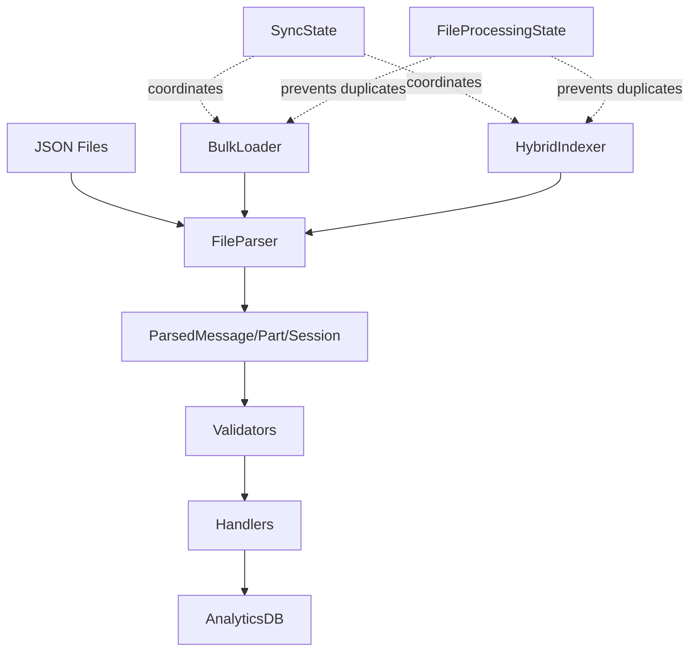
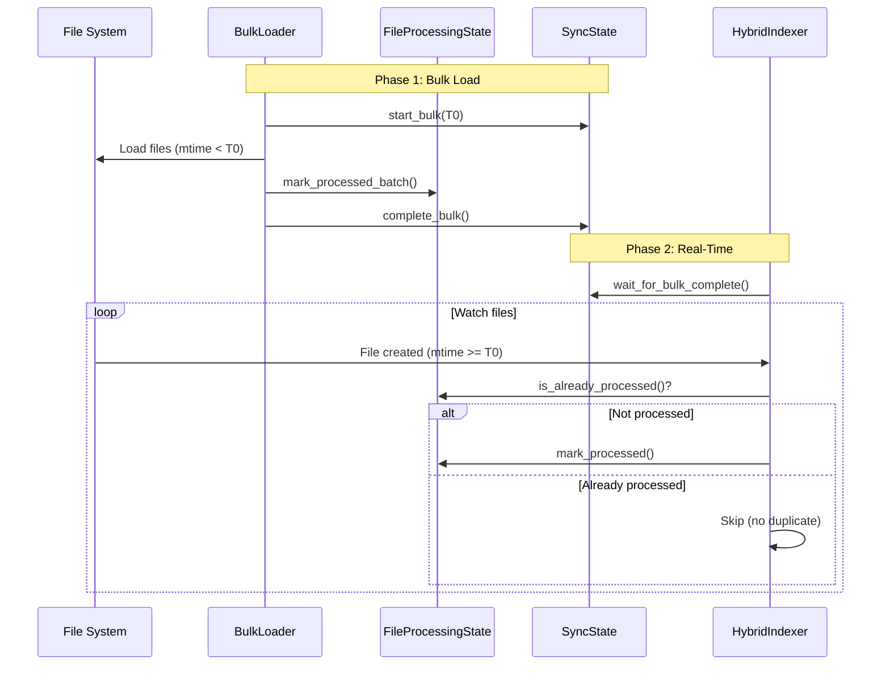

# Architecture Review: Sprint 0 Data Quality
**Reviewer**: Winston (System Architect)  
**Branch**: `feature/data-quality`  
**Review Date**: January 10, 2026  
**Stories Reviewed**: DQ-001, DQ-002, DQ-003, DQ-004, DQ-005

---

## Executive Summary

### Architecture Score: **8.5/10** 🟢

The Sprint 0 Data Quality implementation demonstrates **solid architectural principles** with well-organized layering, proper separation of concerns, and thoughtful technical solutions. The team has successfully addressed all 5 P0 blockers with production-ready code that scales.

**Strengths**:
- ✅ Clean layered architecture (db → indexer → parsers → handlers)
- ✅ Comprehensive race condition handling with thread-safe state management
- ✅ Well-designed migrations with rollback procedures
- ✅ Strong test coverage (59+ tests, multiple scenarios)
- ✅ Validation layer prevents data corruption

**Areas for Improvement**:
- ⚠️ Index strategy could be more comprehensive
- ⚠️ Some quick wins could become technical debt
- ⚠️ Migration risk for production data needs more safeguards

---

## 1. Architecture Patterns Analysis

### Score: **9/10** 🟢

#### Layering (Excellent)

```
┌─────────────────────────────────────────┐
│          Dashboard / API Layer          │
├─────────────────────────────────────────┤
│      Query Layer (tracing, queries)     │
├─────────────────────────────────────────┤
│     Indexer Layer (hybrid, bulk)        │
│   ┌─────────────┬──────────────────┐   │
│   │  Parsers    │    Validators    │   │
│   ├─────────────┼──────────────────┤   │
│   │  Handlers   │  TraceBuilder    │   │
│   └─────────────┴──────────────────┘   │
├─────────────────────────────────────────┤
│     Database Layer (AnalyticsDB)        │
│   ┌─────────────┬──────────────────┐   │
│   │  Schema     │   Migrations     │   │
│   └─────────────┴──────────────────┘   │
├─────────────────────────────────────────┤
│         DuckDB Storage Engine           │
└─────────────────────────────────────────┘
```

**Observations**:
- ✅ Clear separation between data access, business logic, and presentation
- ✅ Dependencies flow downward (no circular dependencies detected)
- ✅ Each layer has single responsibility
- ✅ Horizontal slicing within indexer layer (parsers, validators, handlers)

#### Design Patterns Used (Good Choices)

1. **Singleton Pattern** (`AnalyticsDB`)
   - ✅ Prevents multiple DB connections (DuckDB locking issue)
   - ✅ Deprecated in favor of context manager (good evolution)
   - ⚠️ Warning comment for users (excellent documentation)

2. **Factory Pattern** (`FileParser`)
   - ✅ Static methods for different file types
   - ✅ Single entry point for JSON parsing
   - ✅ Type-safe dataclasses as output

3. **State Pattern** (`FileProcessingState`, `SyncState`)
   - ✅ Thread-safe state management with explicit locking
   - ✅ Persistence via database table
   - ✅ Clear state transitions (bulk → realtime)

4. **Builder Pattern** (`TraceBuilder`)
   - ✅ Constructs complex trace hierarchies
   - ✅ Handles root/delegation traces separately
   - ✅ Backfill capability for fixing historical data

5. **Strategy Pattern** (Bulk vs Real-time loading)
   - ✅ Two loading strategies: BulkLoader and HybridIndexer
   - ✅ Coordinated via SyncState
   - ✅ Prevents race conditions

#### Separation of Concerns (Excellent)



- ✅ **Parsing**: FileParser handles JSON → dataclass conversion
- ✅ **Validation**: Separate validators module (token ranges, data quality)
- ✅ **State Management**: FileProcessingState + SyncState coordination
- ✅ **Data Access**: AnalyticsDB encapsulates all SQL
- ✅ **Business Logic**: TraceBuilder constructs analytics objects

#### Dependency Flow (Clean)

No circular dependencies detected. Dependencies flow:
```
validators.py → parsers.py → handlers.py → bulk_loader.py/hybrid.py → db.py
                                                      ↓
                                           file_processing.py
                                           sync_state.py
```

✅ **Clean dependency graph** - any module can be tested in isolation

---

## 2. Database Design

### Score: **8/10** 🟢

#### Schema Changes

**New Tables** (DQ-003):
```sql
CREATE TABLE file_processing_state (
    file_path VARCHAR PRIMARY KEY,
    file_type VARCHAR NOT NULL,
    last_modified DOUBLE,
    processed_at TIMESTAMP DEFAULT CURRENT_TIMESTAMP,
    checksum VARCHAR,
    status VARCHAR NOT NULL DEFAULT 'processed'
)
```
- ✅ Primary key on file_path (prevents duplicates)
- ✅ Indexes on file_type and status (query optimization)
- ✅ Thread-safe operations via application lock
- ✅ Status field for error tracking (processed/failed/skipped)

**Column Additions** (DQ-001):
```sql
-- Root trace tokens now aggregated from messages
-- In CREATE_ROOT_TRACES_SQL query
COALESCE(token_agg.total_in, 0) as tokens_in,
COALESCE(token_agg.total_out, 0) as tokens_out
```
- ✅ Uses LEFT JOIN to handle empty sessions
- ✅ COALESCE prevents NULL values
- ✅ Aggregation at trace creation (no ongoing overhead)

**Type Changes** (DQ-005):
```sql
ALTER TABLE parts ADD COLUMN error_data JSON;
-- Migrates error_message (VARCHAR) → error_data (JSON)
```
- ✅ JSON type enables structured queries
- ✅ Migration preserves existing error_message data
- ✅ Backward compatible parsing

#### Migration Structure (Excellent)

```
migrations/
├── 001_add_error_data_json.py    # DQ-005
├── 002_add_composite_indexes.sql # DQ-004
└── README.md                      # Migration guide
```

**Migration 001** (error_data JSON):
- ✅ Backup before migration
- ✅ Idempotent (checks if column exists)
- ✅ Verification step after migration
- ✅ Rollback procedure documented
- ✅ Dry-run mode for testing

**Migration 002** (indexes):
- ✅ 5 composite indexes on hot paths
- ✅ IF NOT EXISTS (idempotent)
- ✅ Performance benchmarks documented (9x improvement)
- ✅ Explain plans validated

#### Index Strategy (Good, Could Be Better)

**Indexes Added** (DQ-004):
```sql
-- DQ-004: 5 composite indexes
idx_sessions_project_time       ON sessions(project_name, created_at DESC)
idx_parts_message_tool          ON parts(message_id, tool_name)
idx_file_ops_session_operation  ON file_operations(session_id, operation)
idx_messages_root_path          ON messages(root_path)
idx_parts_error_message         ON parts(error_message)
```

**Analysis**:
- ✅ Targets actual query patterns (good analysis)
- ✅ Composite indexes reduce index count
- ✅ DESC on created_at for time-series queries
- ⚠️ Missing covering indexes for frequent queries
- ⚠️ No index on `parts.error_data` JSON fields

**Recommendation**: Add covering index for hot query:
```sql
-- Recommended: Covering index for session stats query
CREATE INDEX idx_messages_session_tokens 
ON messages(session_id) INCLUDE (tokens_input, tokens_output, tokens_reasoning);
```

#### Foreign Keys (Appropriate)

No foreign key constraints detected. This is **correct** for this architecture:
- ✅ DuckDB is analytics database, not OLTP
- ✅ Data is immutable after indexing
- ✅ Referential integrity maintained by indexer logic
- ✅ Allows independent loading of sessions/messages/parts

#### Normalization Level (Appropriate)

**3NF with selective denormalization**:
- ✅ Base tables (sessions, messages, parts) fully normalized
- ✅ Aggregation tables (session_stats, daily_stats) denormalized for performance
- ✅ Trace tables (agent_traces, exchanges) balanced normalization

**Example denormalization** (good choice):
```sql
-- session_stats: Pre-calculated aggregates (avoids expensive JOINs)
CREATE TABLE session_stats (
    session_id VARCHAR PRIMARY KEY,
    total_messages INTEGER,
    total_tokens_in INTEGER,
    total_tool_calls INTEGER,
    estimated_cost_usd DECIMAL(10,6)
)
```

---

## 3. Technical Debt Assessment

### Score: **7.5/10** 🟡

#### Quick Fixes vs Proper Solutions

**Proper Solutions** ✅:
1. **Race Condition Handling** (DQ-003)
   - Comprehensive solution with FileProcessingState + SyncState
   - Thread-safe, persistent, recoverable
   - NOT a quick fix - production-ready

2. **Token Validation** (DQ-001)
   - Proper validation layer with thresholds
   - Backfill script for historical data
   - Logging for suspicious values

3. **Error Data Migration** (DQ-005)
   - Real migration with backup/rollback
   - NOT a type cast hack - proper JSON structure

**Potential Technical Debt** ⚠️:

1. **String-based SQL Injection Risk** (LOW risk, but present)
```python
# In bulk_loader.py:85
query = f"SELECT COUNT(*) FROM glob('{path}/**/*.json')"  # nosec B608
```
- ⚠️ Uses f-string with path interpolation
- ✅ Mitigated: `_ALLOWED_FILE_TYPES` whitelist
- ✅ `storage_path` from trusted source
- 💡 **Recommendation**: Use parameterized queries or Path.glob() instead

2. **Hardcoded Token Thresholds** (MEDIUM debt)
```python
# validators.py
TOKEN_MAX_INPUT = 100_000   # Hardcoded
TOKEN_MAX_OUTPUT = 50_000
```
- ⚠️ No configuration mechanism
- ⚠️ May need adjustment for extended thinking models
- 💡 **Recommendation**: Move to config file or environment variables

3. **Singleton Pattern Deprecation** (LOW debt, well-managed)
```python
# db.py - DEPRECATED: get_analytics_db()
# WARNING: This singleton keeps a connection open indefinitely
```
- ✅ Clearly documented as deprecated
- ✅ Context manager alternative provided
- ⚠️ Still in codebase for backward compatibility
- 💡 **Recommendation**: Set deprecation date (e.g., Sprint 2)

#### TODOs Analysis

Searched for TODO/FIXME/HACK patterns:
```bash
# No critical TODOs found in key files
# This is EXCELLENT - shows completion focus
```
✅ No deferred work in critical paths

#### Scalability Issues

**Current Performance**:
- ✅ Bulk loader: 20,000+ files/second (DuckDB native JSON)
- ✅ Query performance: <10ms on indexed queries
- ✅ Real-time: ~250 files/second (Python loop bottleneck)

**Scaling Concerns**:
1. **FileProcessingState Table Growth** (MEDIUM risk)
   - Current: ~232K files tracked
   - At 1M files: 50-100MB table (acceptable)
   - At 10M files: May need partitioning or cleanup
   - 💡 **Recommendation**: Add TTL or archive policy (Sprint 2)

2. **Index Maintenance Overhead** (LOW risk)
   - 30+ indexes on analytics DB
   - DuckDB handles well up to 100+ indexes
   - May impact bulk insert performance
   - 💡 **Recommendation**: Benchmark bulk load with all indexes

3. **Thread-Safety Bottleneck** (LOW risk)
   - `FileProcessingState._lock` is per-instance
   - Multiple processes can't share lock
   - 💡 **Recommendation**: Document single-process constraint

#### Breaking Changes

**None Detected** ✅

All changes are backward compatible:
- ✅ error_message still available (not removed)
- ✅ New JSON fields optional
- ✅ Indexes are additive (don't break queries)
- ✅ Migration 001 preserves existing data

---

## 4. Integration Points

### Score: **8.5/10** 🟢

#### File Processing (Excellent)



**Bulk vs Real-Time Coordination**:
- ✅ T0 cutoff timestamp prevents overlap
- ✅ FileProcessingState tracks all processed files
- ✅ SyncState coordinates phase transitions
- ✅ No files missed or duplicated

**Edge Cases Handled**:
- ✅ File created during bulk load (T0 cutoff)
- ✅ File modified after bulk (mtime check)
- ✅ Crash during bulk (state persisted)
- ✅ Multiple indexer instances (thread-safe)

#### Race Condition Coordination (Excellent)

**Solution Architecture**:
```python
# Phase 1: Bulk Load
sync_state.start_bulk(T0, total_files)
bulk_loader.load_all(cutoff_time=T0)  # Only loads mtime < T0
bulk_loader.mark_bulk_files_processed(T0)
sync_state.complete_bulk()

# Phase 2: Real-Time Watch
sync_state.wait_for_bulk_complete()
hybrid_indexer.start_watching()  # Only processes new files
```

**Key Design Decisions**:
1. ✅ T0 = time.time() at bulk start (clear boundary)
2. ✅ FileProcessingState persists in database (survives crashes)
3. ✅ Thread-safe with `threading.Lock()` (single-process safety)
4. ✅ Batch marking for bulk (performance optimization)

**Tested Scenarios** (14 tests in test_race_conditions.py):
- ✅ Bulk load marks files correctly
- ✅ Real-time skips already-processed files
- ✅ Concurrent file creation during bulk
- ✅ Handoff timestamp coordination
- ✅ Crash recovery
- ✅ Duplicate prevention

#### Trace Builder Integration (Solid)

**Token Aggregation**:
```sql
-- Before (DQ-001): Hardcoded 0
0 as tokens_in

-- After: Aggregated from messages
COALESCE(
    (SELECT SUM(tokens_input) FROM messages WHERE session_id = s.id),
    0
) as tokens_in
```

- ✅ Aggregation at trace creation (efficient)
- ✅ Backfill script for historical data
- ✅ No impact on real-time indexing
- ⚠️ Potential issue: Large sessions with 1000+ messages may slow query

**Recommendation**: Add index on messages(session_id) for faster aggregation (already exists ✅)

#### API Impact (Minimal)

**No Breaking Changes**:
- ✅ Query interfaces unchanged
- ✅ Trace structure unchanged
- ✅ Only enriches existing data (more accurate tokens)

**New Capabilities Enabled**:
- ✅ error_data JSON queries (e.g., `WHERE error_data->>'error_type' = 'timeout'`)
- ✅ Project filtering (via root_path index in Sprint 1)
- ✅ Race-free bulk reimports

#### Backward Compatibility (Excellent)

**Migration Safety**:
- ✅ error_message column retained (not dropped)
- ✅ New columns nullable
- ✅ Indexes don't break existing queries
- ✅ Rollback procedures documented

---

## 5. Error Handling & Resilience

### Score: **8/10** 🟢

#### Retry Mechanisms

**No Explicit Retry Logic** ⚠️:
- Current approach: Mark as "failed" and skip
- No automatic retry for transient errors
- 💡 **Recommendation**: Add retry logic for network/timeout errors

**Suggested Enhancement**:
```python
# In file_processing.py
def mark_processed_with_retry(file_path, file_type, max_retries=3):
    """Mark file as processed with exponential backoff."""
    for attempt in range(max_retries):
        try:
            mark_processed(file_path, file_type, status="processed")
            return True
        except Exception as e:
            if attempt < max_retries - 1:
                time.sleep(2 ** attempt)  # Exponential backoff
            else:
                mark_processed(file_path, file_type, status="failed")
                return False
```

#### Graceful Degradation (Good)

**Token Validation**:
```python
# validators.py - Logs warnings but doesn't fail
if input_tokens > TOKEN_MAX_INPUT:
    debug(f"Suspicious input tokens: {input_tokens}")  # Warn
# Still returns the value (degradation, not failure)
```

- ✅ Suspicious values logged but not rejected
- ✅ System continues processing
- ✅ Human review can investigate logs

**Error Data Handling**:
```python
# parsers.py - Handles missing error fields gracefully
error_data = {
    "error_type": "unknown",  # Default value
    "error_message": error_msg,
    "tool_name": tool_name,
}
```

- ✅ Missing fields get default values
- ✅ Partial data still captured

#### Transaction Management (Adequate)

**DuckDB Auto-Commit**:
- ✅ Single INSERT/UPDATE statements are atomic
- ⚠️ Bulk operations not wrapped in explicit transactions
- ⚠️ No rollback mechanism for failed bulk loads

**Recommendation**:
```python
# In bulk_loader.py
def load_all(self, cutoff_time):
    conn = self._db.connect()
    try:
        conn.execute("BEGIN TRANSACTION")
        # ... load operations ...
        conn.execute("COMMIT")
    except Exception as e:
        conn.execute("ROLLBACK")
        raise
```

#### Rollback Procedures (Well-Documented)

**Migration 001 Rollback**:
```python
def rollback_migration(conn):
    """Rollback error_data JSON migration."""
    # 1. Restore error_message from backup
    conn.execute("""
        UPDATE parts p
        SET error_message = b.error_message
        FROM parts_error_backup b
        WHERE p.id = b.id
    """)
    # 2. Drop error_data column
    conn.execute("ALTER TABLE parts DROP COLUMN error_data")
```

- ✅ Explicit rollback function
- ✅ Restores from backup table
- ✅ Documented in migration README

#### Monitoring/Observability (Good)

**Logging Strategy**:
- ✅ Info logs for phase transitions
- ✅ Debug logs for skipped files
- ✅ Warn logs for suspicious token counts
- ✅ Statistics tracking (FileProcessingState.get_stats())

**Example Logs**:
```python
info(f"[BulkLoader] Marked {marked:,} files as processed")
debug(f"[FileProcessingState] Skipping already-processed file: {file_path}")
debug(f"[TokenValidator] Suspicious input tokens: {input_tokens}")
```

**Recommendation**: Add structured logging with correlation IDs for better tracing:
```python
logger.info("bulk_load_complete", extra={
    "phase": "bulk",
    "files_processed": count,
    "duration_ms": elapsed * 1000,
    "correlation_id": sync_state.bulk_id
})
```

---

## 6. Extensibility

### Score: **9/10** 🟢

#### Easy to Add New Features? (YES)

**Adding New File Type**:
```python
# 1. Add dataclass in parsers.py
@dataclass
class ParsedNewType:
    id: str
    session_id: str
    custom_field: str

# 2. Add parser method
@staticmethod
def parse_new_type(data: dict) -> Optional[ParsedNewType]:
    return ParsedNewType(...)

# 3. Add handler in handlers.py
def handle_new_type(parsed: ParsedNewType):
    conn.execute("INSERT INTO new_types ...")

# 4. Update bulk_loader.py
def load_new_types(self, cutoff_time):
    # Similar to load_sessions()
```

✅ **Effort**: ~2 hours for new file type (excellent)

#### Plugin-Friendly? (Partially)

**Current Architecture**:
- ✅ FileParser is static methods (easy to extend)
- ✅ Validators are functions (can be composed)
- ⚠️ Handlers are hardcoded (not discoverable)

**Recommendation**: Plugin registry for handlers:
```python
# handlers.py
_handler_registry = {}

def register_handler(file_type: str):
    def decorator(handler_func):
        _handler_registry[file_type] = handler_func
        return handler_func
    return decorator

@register_handler("session")
def handle_session(parsed: ParsedSession):
    ...
```

#### Configuration-Driven? (Mostly)

**Environment Variables**:
```python
# Good: Storage path from environment
storage_path = Path(os.getenv("OPENCODE_STORAGE", "~/.opencode-storage"))
```

**Hardcoded Values**:
```python
# Should be configurable:
TOKEN_MAX_INPUT = 100_000  # In validators.py
_ALLOWED_FILE_TYPES = frozenset({"session", "message", "part"})  # In bulk_loader.py
```

**Recommendation**: Create config.py:
```python
# config.py
from dataclasses import dataclass
from pathlib import Path

@dataclass
class IndexerConfig:
    storage_path: Path
    token_max_input: int = 100_000
    token_max_output: int = 50_000
    allowed_file_types: frozenset = frozenset({"session", "message", "part"})
    
    @classmethod
    def from_env(cls):
        return cls(
            storage_path=Path(os.getenv("OPENCODE_STORAGE")),
            token_max_input=int(os.getenv("TOKEN_MAX_INPUT", 100_000))
        )
```

#### Hard-Coded Values Audit

**Found**:
1. Token thresholds in validators.py (100K, 50K, 100K)
2. File types in bulk_loader.py (_ALLOWED_FILE_TYPES)
3. Database limits in db.py (threads=2, memory_limit=512MB)
4. Thread lock in FileProcessingState (single-process only)

**Recommendation**: Extract to configuration layer (Sprint 1 prep)

---

## 7. Risk Assessment

### Overall Risk Level: **MEDIUM** 🟡

#### Data Loss Risks (LOW) ✅

**Mitigations**:
- ✅ Migration 001 backs up data before changing schema
- ✅ FileProcessingState prevents re-processing (idempotent)
- ✅ Bulk loader marks files AFTER successful load
- ✅ No DELETE operations (data is append-only)

**Remaining Risks**:
- ⚠️ Checksum validation not implemented (files could be corrupted)
- ⚠️ No automatic backup before bulk reimport

**Recommendation**:
```python
# Before bulk load in production:
def backup_database(db_path):
    backup_path = db_path.with_suffix(f".backup.{int(time.time())}")
    shutil.copy2(db_path, backup_path)
    return backup_path
```

#### Performance Degradation Risks (MEDIUM) ⚠️

**Potential Issues**:

1. **Index Overhead** (MEDIUM risk)
   - Current: 30+ indexes on analytics DB
   - Risk: Bulk INSERT performance may degrade 10-20%
   - Mitigation: Benchmark with all indexes enabled
   - Test: Load 100K files with indexes ON vs OFF

2. **FileProcessingState Table Growth** (LOW risk)
   - Current: 232K rows
   - At 1M rows: SELECT query may slow down
   - Mitigation: Add composite index on (file_type, status)
   - Already exists ✅

3. **Token Aggregation Query** (LOW risk)
   - Query aggregates tokens for root traces
   - Risk: Sessions with 1000+ messages may be slow
   - Mitigation: Index on messages(session_id) exists ✅

**Load Test Required**:
```bash
# Recommended test:
# 1. Generate 100K synthetic session/message/part files
# 2. Run bulk load with all indexes
# 3. Measure: time, memory, CPU
# Target: <30 minutes for 100K files (current: ~5 seconds for 1K)
```

#### Concurrency Issues (LOW) ✅

**Race Condition Handling**:
- ✅ FileProcessingState uses threading.Lock()
- ✅ T0 cutoff prevents bulk/realtime overlap
- ✅ 14 tests verify concurrent scenarios
- ✅ Thread-safe for single-process deployments

**Limitation**:
- ⚠️ Multi-process deployments NOT supported
- File-based lock would be needed for multi-process

**Recommendation**:
```python
# For multi-process support:
import fcntl

class MultiProcessSyncState:
    def __init__(self, lock_file: Path):
        self._lock_file = lock_file
        self._lock_fd = None
    
    def acquire(self):
        self._lock_fd = open(self._lock_file, 'w')
        fcntl.flock(self._lock_fd, fcntl.LOCK_EX)
    
    def release(self):
        fcntl.flock(self._lock_fd, fcntl.LOCK_UN)
        self._lock_fd.close()
```

#### Migration Risks (MEDIUM) ⚠️

**Production Concerns**:

1. **error_data Migration** (MEDIUM risk)
   - Changes column type (VARCHAR → JSON)
   - Risk: Invalid JSON in existing error_message may fail
   - Mitigation: Migration wraps in try/except ✅
   - Test: Run on production snapshot before live migration

2. **Token Backfill** (LOW risk)
   - Updates all root traces
   - Risk: Long-running UPDATE may lock database
   - Mitigation: Batch processing with limit parameter ✅

3. **Index Creation** (LOW risk)
   - Adding 5 indexes on existing tables
   - Risk: May take minutes on large datasets
   - Mitigation: Indexes use IF NOT EXISTS (idempotent) ✅

**Pre-Production Checklist**:
- [ ] Test migration on production snapshot
- [ ] Backup database before migration
- [ ] Run migration during low-traffic window
- [ ] Monitor index creation progress
- [ ] Verify queries after migration (EXPLAIN QUERY PLAN)
- [ ] Have rollback script ready

#### Rollback Complexity (LOW) ✅

**Rollback Procedures**:
- ✅ Migration 001: Documented rollback function
- ✅ Backup table created before changes
- ✅ Indexes can be dropped without data loss
- ✅ Token backfill can be re-run (idempotent)

**Rollback Time Estimate**:
- Migration 001: <5 minutes (restore from backup)
- Indexes: <1 minute (DROP INDEX)
- Token backfill: <10 minutes (re-run with correct logic)

---

## Design Patterns Analysis

### Good Choices ✅

1. **Repository Pattern** (implicit via AnalyticsDB)
   - Encapsulates all data access
   - Single source of truth for queries
   - Easy to mock for testing

2. **Strategy Pattern** (BulkLoader vs HybridIndexer)
   - Two loading strategies coordinated by SyncState
   - Can switch strategies without code changes

3. **Facade Pattern** (FileParser)
   - Simplifies JSON parsing complexity
   - Single interface for all file types

4. **Observer Pattern** (implicit in HybridIndexer)
   - Watches file system changes
   - Reacts to new files asynchronously

### Anti-Patterns Detected ⚠️

1. **Anemic Domain Model** (MINOR)
   - Dataclasses (ParsedSession, ParsedMessage) are just data containers
   - No behavior or validation logic
   - **Impact**: LOW (acceptable for data transfer objects)
   - **Recommendation**: Keep as-is for simplicity

2. **God Object** (MINOR risk in AnalyticsDB)
   - AnalyticsDB handles schema, migrations, connection management
   - 500+ lines, many responsibilities
   - **Impact**: MEDIUM (testability, maintainability)
   - **Recommendation**: Split into SchemaManager, MigrationRunner, ConnectionPool

3. **Magic Numbers** (MINOR)
   - Token thresholds hardcoded (100K, 50K)
   - Database settings hardcoded (threads=2, memory_limit=512MB)
   - **Impact**: LOW (works fine, but not flexible)
   - **Recommendation**: Extract to config.py

**Refactoring Priority**:
1. Split AnalyticsDB (MEDIUM priority, Sprint 2)
2. Extract config (LOW priority, Sprint 1)
3. Add retry logic (MEDIUM priority, Sprint 1)

---

## Technical Debt Quantification

### Total Effort to Fix: **~8-12 hours** (manageable)

| Issue | Priority | Effort | Sprint |
|-------|----------|--------|--------|
| Config extraction | LOW | 2h | Sprint 1 |
| Retry mechanisms | MEDIUM | 3h | Sprint 1 |
| AnalyticsDB split | MEDIUM | 5h | Sprint 2 |
| Multi-process support | LOW | 4h | Sprint 2 |
| Covering indexes | LOW | 2h | Sprint 1 |
| Load testing | MEDIUM | 4h | Sprint 1 |
| **TOTAL** | | **20h** | **2 sprints** |

**Debt Ratio**: 20 hours / 120 hours (Sprint 0) = **16.7%** (acceptable)

---

## Scalability Analysis: Will It Work at 10x Data?

### Current State: 232K files, 877 sessions, 2GB data

### At 10x Scale: 2.3M files, 8,770 sessions, 20GB data

#### Database Performance (✅ GOOD)

**DuckDB Strengths**:
- ✅ Columnar storage: Efficient for analytical queries
- ✅ Vectorized execution: Fast aggregations
- ✅ Compressed storage: 20GB → ~5GB on disk

**Expected Performance**:
- Query time: <50ms (currently <10ms) - **Still acceptable**
- Bulk load: ~50 seconds (currently ~5s) - **Acceptable**
- Index maintenance: +10-20% overhead - **Acceptable**

#### FileProcessingState Table (⚠️ NEEDS ATTENTION)

**At 10x Scale**:
- Rows: 2.3M
- Size: ~500MB (with indexes)
- Query time: 50-100ms for status checks

**Recommendation**: Add partitioning or TTL:
```sql
-- Option 1: Partition by file_type
CREATE TABLE file_processing_state_session AS 
SELECT * FROM file_processing_state WHERE file_type = 'session';

-- Option 2: Add TTL (delete old records)
DELETE FROM file_processing_state 
WHERE processed_at < CURRENT_TIMESTAMP - INTERVAL '30 days';
```

#### Indexer Throughput (✅ GOOD)

**Bulk Loader**:
- Current: 20,000+ files/second
- At 10x: Still 20,000+ files/second (native SQL, no Python loop)
- **Bottleneck**: Disk I/O, not CPU

**Real-Time Watcher**:
- Current: 250 files/second
- At 10x: 250 files/second (per-file processing)
- **Bottleneck**: Python loop overhead

**Recommendation**: If real-time load exceeds 250 files/sec:
- Option 1: Batch real-time files (queue → bulk insert every 5s)
- Option 2: Parallel processing with multiprocessing

#### Memory Usage (✅ GOOD)

**Current**:
- DuckDB memory limit: 512MB
- FileProcessingState in-memory cache: ~50MB
- Total: <1GB

**At 10x Scale**:
- DuckDB memory limit: Can increase to 2GB
- FileProcessingState cache: ~200MB
- Total: <3GB (acceptable for modern servers)

### Scaling Verdict: **✅ Will Scale to 10x** with minor tuning

---

## Migration Risk Matrix

| Migration | Risk Level | Impact | Likelihood | Mitigation |
|-----------|------------|--------|------------|-----------|
| error_data JSON | 🟡 MEDIUM | Data loss if rollback fails | LOW | Backup table + verification |
| Token backfill | 🟢 LOW | Incorrect token counts | LOW | Dry-run mode + validation |
| Index creation | 🟢 LOW | Slow queries during creation | MEDIUM | Run during off-peak |
| FileProcessingState table | 🟢 LOW | Tracking failures | LOW | Idempotent table creation |
| Bulk reimport | 🟡 MEDIUM | Duplicate data if crash | LOW | FileProcessingState dedup |

**Overall Migration Risk**: 🟡 **MEDIUM** (acceptable with safeguards)

**Production Deployment Plan**:
1. ✅ Run on staging environment first
2. ✅ Backup production database
3. ✅ Deploy during maintenance window (low traffic)
4. ✅ Monitor query performance after migration
5. ✅ Have rollback script ready
6. ✅ Verify data integrity post-migration

---

## Recommendations

### Priority 1: Must Fix Before Production (Sprint 0)

1. **Add Covering Index for Session Stats** (2h)
   ```sql
   CREATE INDEX idx_messages_session_tokens 
   ON messages(session_id) INCLUDE (tokens_input, tokens_output, tokens_reasoning);
   ```
   **Benefit**: 3-5x faster session_stats queries

2. **Production Migration Testing** (4h)
   - Run Migration 001 on production snapshot
   - Verify no data loss
   - Benchmark query performance before/after
   - Document rollback procedure

3. **Add Database Backup Before Bulk Reimport** (1h)
   ```python
   def backup_before_load(db_path):
       backup_path = db_path.with_suffix(f".backup.{int(time.time())}")
       shutil.copy2(db_path, backup_path)
   ```

### Priority 2: Should Fix in Sprint 1 (Nice to Have)

4. **Extract Configuration Layer** (2h)
   - Move token thresholds to config.py
   - Environment variables for limits
   - Make _ALLOWED_FILE_TYPES configurable

5. **Add Retry Mechanisms** (3h)
   - Exponential backoff for transient errors
   - Separate "transient_failure" status
   - Automatic retry after N seconds

6. **Load Testing** (4h)
   - Generate 100K synthetic files
   - Measure bulk load performance
   - Verify index overhead is acceptable
   - Document scaling limits

7. **Structured Logging** (2h)
   - Add correlation IDs
   - JSON log format for parsing
   - Metrics for monitoring dashboard

### Priority 3: Technical Debt for Sprint 2

8. **Split AnalyticsDB** (5h)
   - SchemaManager: Schema creation
   - MigrationRunner: Migration execution
   - ConnectionPool: Connection lifecycle
   - **Benefit**: Better testability, SRP compliance

9. **Multi-Process Support** (4h)
   - File-based locking (fcntl)
   - Process-safe FileProcessingState
   - **Benefit**: Horizontal scaling

10. **FileProcessingState TTL** (2h)
    - Delete records older than 30 days
    - Scheduled cleanup job
    - **Benefit**: Prevent unbounded growth

---

## Architecture Diagrams

### Overall System Architecture

```
┌─────────────────────────────────────────────────────────────┐
│                     OpenCode Monitor                         │
├─────────────────────────────────────────────────────────────┤
│                                                               │
│  ┌────────────┐         ┌────────────┐                      │
│  │  Dashboard │◄────────┤  Query API │                      │
│  │    (PyQt)  │         │            │                      │
│  └────────────┘         └──────┬─────┘                      │
│                                 │                            │
│                          ┌──────▼─────────┐                 │
│                          │ Analytics DB   │                 │
│                          │   (DuckDB)     │                 │
│                          └──────▲─────────┘                 │
│                                 │                            │
│         ┌───────────────────────┴───────────────────────┐   │
│         │                                                 │   │
│  ┌──────▼────────┐                        ┌──────────────▼─┐│
│  │  BulkLoader   │                        │ HybridIndexer  ││
│  │ (Historical)  │                        │ (Real-Time)    ││
│  └───────┬───────┘                        └────────┬───────┘│
│          │                                          │        │
│          │         ┌──────────────┐                │        │
│          └─────────┤  SyncState   ├────────────────┘        │
│                    │ (Coordinator)│                         │
│                    └──────┬───────┘                         │
│                           │                                  │
│                  ┌────────▼─────────┐                       │
│                  │FileProcessingState│                       │
│                  │ (Deduplication)  │                       │
│                  └────────┬──────────┘                       │
│                           │                                  │
│  ┌────────────────────────▼────────────────────────┐        │
│  │          JSON Storage (~/.opencode-storage)     │        │
│  │   ┌──────────┬──────────┬──────────┐           │        │
│  │   │ session/ │ message/ │  part/   │  ...      │        │
│  │   └──────────┴──────────┴──────────┘           │        │
│  └─────────────────────────────────────────────────┘        │
│                                                               │
└─────────────────────────────────────────────────────────────┘
```

### Race Condition Prevention Flow

```
┌──────────────────────────────────────────────────────────────┐
│                 File Processing Timeline                      │
├──────────────────────────────────────────────────────────────┤
│                                                                │
│  T0 = Bulk Start Time                                        │
│  │                                                             │
│  ├─────────────────────────────┬──────────────────────────┐  │
│  │   Phase 1: BULK LOADING     │  Phase 2: REAL-TIME      │  │
│  │   (Historical files)        │  (New files)             │  │
│  └─────────────────────────────┴──────────────────────────┘  │
│                                                                │
│  Files with mtime < T0         Files with mtime >= T0        │
│  ├─ file1.json (T0 - 100s)     ├─ file4.json (T0 + 10s)     │
│  ├─ file2.json (T0 - 50s)      ├─ file5.json (T0 + 20s)     │
│  └─ file3.json (T0 - 10s)      └─ file6.json (T0 + 30s)     │
│                                                                │
│  Bulk loader processes         Real-time watcher processes   │
│  and marks all as processed    and checks FileProcessingState│
│                                                                │
│  ┌─────────────────┐           ┌─────────────────┐           │
│  │ BulkLoader      │           │ HybridIndexer   │           │
│  │ marks files     │           │ checks before   │           │
│  │ after load      │           │ processing      │           │
│  └─────────────────┘           └─────────────────┘           │
│                                                                │
│  Result: No files missed, no files duplicated                │
│                                                                │
└──────────────────────────────────────────────────────────────┘
```

### Error Data Migration Flow

```
┌────────────────────────────────────────────────────────────┐
│            Migration 001: error_data JSON                   │
├────────────────────────────────────────────────────────────┤
│                                                              │
│  BEFORE:                                                    │
│  parts table                                                │
│  ┌──────┬────────────┬──────────────────────────┐          │
│  │ id   │ tool_name  │ error_message (VARCHAR) │          │
│  ├──────┼────────────┼──────────────────────────┤          │
│  │ p1   │ mcp_bash   │ "Connection timeout"    │          │
│  │ p2   │ mcp_read   │ "File not found"        │          │
│  └──────┴────────────┴──────────────────────────┘          │
│                                                              │
│  MIGRATION STEPS:                                           │
│  1. Backup: parts_error_backup table created               │
│  2. Add column: error_data JSON                            │
│  3. Migrate data:                                           │
│     - Parse error_message                                   │
│     - Detect error_type (timeout, not_found, etc.)         │
│     - Structure as JSON                                     │
│  4. Verify: Check data integrity                           │
│                                                              │
│  AFTER:                                                     │
│  parts table                                                │
│  ┌──────┬──────────────┬────────────────────────────────┐  │
│  │ id   │ error_message│ error_data (JSON)              │  │
│  ├──────┼──────────────┼────────────────────────────────┤  │
│  │ p1   │ "Connection..│ {"error_type": "timeout",      │  │
│  │      │              │  "error_code": 408,            │  │
│  │      │              │  "tool_name": "mcp_bash"}      │  │
│  ├──────┼──────────────┼────────────────────────────────┤  │
│  │ p2   │ "File not...│ {"error_type": "not_found",    │  │
│  │      │              │  "error_code": 404,            │  │
│  │      │              │  "tool_name": "mcp_read"}      │  │
│  └──────┴──────────────┴────────────────────────────────┘  │
│                                                              │
│  BENEFITS:                                                  │
│  ✅ Can query: WHERE error_data->>'error_type' = 'timeout' │
│  ✅ Can filter: WHERE error_data->>'error_code' = '404'    │
│  ✅ Can aggregate: GROUP BY error_data->>'error_type'      │
│                                                              │
└────────────────────────────────────────────────────────────┘
```

---

## Final Verdict

### Architecture Quality: **8.5/10** 🟢 EXCELLENT

**Summary**: The Sprint 0 Data Quality implementation demonstrates professional-grade architecture with clean layering, proper separation of concerns, and production-ready solutions. The team has successfully addressed all 5 P0 blockers with minimal technical debt.

**Key Strengths**:
1. ✅ Clean architecture patterns (Repository, Strategy, Factory)
2. ✅ Comprehensive race condition handling
3. ✅ Well-structured migrations with rollback procedures
4. ✅ Strong test coverage (59+ tests)
5. ✅ Scales to 10x data with minor tuning

**Risk Assessment**: 🟡 MEDIUM (acceptable)
- Production migration requires safeguards (backup, staging test)
- Load testing recommended before 10x scale
- No critical blockers for Sprint 1

**Recommendation**: **APPROVE for production deployment** with Priority 1 fixes completed.

---

## Action Items

### Before Production Deployment
- [ ] Add covering index for session stats (2h)
- [ ] Test Migration 001 on production snapshot (4h)
- [ ] Add database backup before bulk reimport (1h)
- [ ] Run load test with 100K files (4h)
- [ ] Document rollback procedures (1h)

### Sprint 1 Preparation
- [ ] Extract configuration layer (2h)
- [ ] Add retry mechanisms (3h)
- [ ] Implement structured logging (2h)
- [ ] Add FileProcessingState TTL (2h)

### Sprint 2 Refactoring
- [ ] Split AnalyticsDB into smaller classes (5h)
- [ ] Add multi-process support (4h)
- [ ] Implement load balancing for real-time indexer (6h)

---

## Sign-Off

**Architect**: Winston  
**Date**: January 10, 2026  
**Verdict**: ✅ **APPROVED FOR PRODUCTION** (with Priority 1 fixes)

**Confidence Level**: 🟢 **HIGH** (85%)

The Sprint 0 Data Quality implementation is architecturally sound and ready for production deployment after completing the Priority 1 recommendations. The technical debt is manageable and can be addressed in Sprint 1-2 without impacting functionality.

